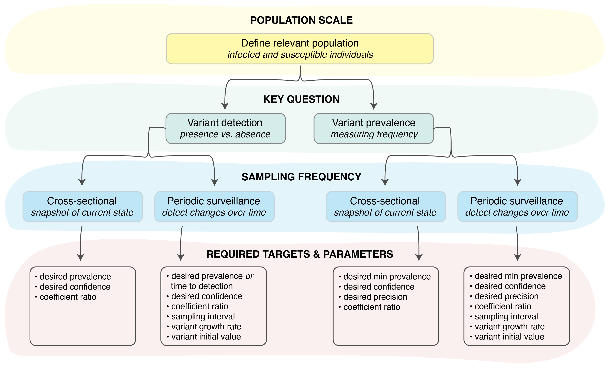

```{r setup, include=FALSE}
knitr::opts_knit$set(root.dir="../")
knitr::opts_chunk$set(fig.width=7.5, fig.height=6, fig.path='../figures/raw/', warning=FALSE, message=FALSE,cache=FALSE,dev=c('png','pdf'))
```

```{r packages, echo=FALSE}

# packages needed for analytical plots
library(ggplot2)
library(reshape2)
library(dplyr)
library(gridExtra)
library(RColorBrewer)
library(metR)

library(phylosamp)
source("source/plot_funcs.R")

```

<br>
<br>

##### Figure 1. Decision tree for designing a variant surveillance program.

<br>
<br>

##### Figure 2. Factors affecting observed variant prevalence.

<br>
<br>

##### Figure 3. Schematic of variant surveillance model.

<br>
<br>

```{r params, echo=FALSE}

# set up multiple values of coefficient ratios to plot
# desired range: c_ratio from approx 1-3
c1 <- seq(1,3,0.01)
c2 <- rep(1,length(c1))
c_ratio <- c1/c2

# desired probability of detection
prob_detect <- 0.95

# desired confidence in measurement
conf_measure <- 0.95
precision <- 0.25

```

##### Figure 4. Exploring the effects of the coefficient of detection.

```{r bias, echo=FALSE, fig.width=6, fig.height=4}

## make plot showing how bias in observed prevalence varies with the coefficient of detection

# calculate bias based on desired coefficient ratios
# for a small number of input variant proportions
p <- c(0.1,seq(0.2,0.99,0.2))
b <- expand.grid(p,c_ratio)
colnames(b) <- c("p_v1","c_ratio")
mbias <- apply(b,1,function(x) phylosamp::varfreq_expected_mbias(x["p_v1"][[1]],x["c_ratio"][[1]]))

# create data frame needed for plotting
df <- data.frame(b,c_ratio,mbias)

# set up colors for plotting
blue = brewer.pal(n = 9, "Blues")[4:9]

bias_plot <- ggplot(data = df, aes(x=c_ratio, y=mbias)) +
  geom_line(aes(color=factor(p_v1)),linewidth=1) +
  scale_y_continuous(expand = c(0.02,0), limits = c(1,2.5)) +
  scale_x_continuous(expand = c(0.02,0)) +
  scale_colour_manual(values=blue,name=expression(P[V[1]])) +
  labs(y=("Bias in observed prevalence"), x=expression(C[V[1]]/C[V[2]])) +
  theme_bw() +
  theme(axis.line = element_line(colour = "black"),
    panel.border = element_blank(),
    panel.background = element_blank(),
    #legend.position = "bottom",
    legend.title=element_text(size=10))

```

```{r samplesize_detection, echo=FALSE, fig.width=6, fig.height=4}

## make plot showing how sample size for detection changes with the coefficient of detection

# calculate bias based on desired coefficient ratios
# for a small number of input variant proportions
# set omega = 1 to get number of sequences needed (not samples)
p <- seq(0.02,0.1,0.02)
b <- expand.grid(p,c_ratio)
colnames(b) <- c("p_v1","c_ratio")
n <- apply(b,1,function(x) phylosamp::vartrack_samplesize_detect(
  p_v1=x["p_v1"][[1]],prob=prob_detect,c_ratio=x["c_ratio"][[1]],omega=1,sampling_freq="xsect"))

# create data frame needed for plotting
df <- data.frame(b,n)

# set up colors for plotting
red = brewer.pal(n = 9, "Reds")[4:9]

ss_detect <- ggplot(data = df, aes(x=c_ratio, y=n)) +
  geom_line(aes(color=factor(p_v1)),linewidth=1) +
  scale_colour_manual(values=red,name=expression(P[V[1]])) +
  scale_y_continuous(expand = c(0.02,0), limits = c(0,150), breaks = c(0,50,100,150)) +
  scale_x_continuous(expand = c(0.02,0)) +
  labs(y="Sequences required", x=expression(C[V[1]]/C[V[2]])) +
  theme_bw() +
  theme(axis.line = element_line(colour = "black"),
    panel.border = element_blank(),
    panel.background = element_blank(),
    #legend.position = "bottom",
    legend.title=element_text(size=10))

```

```{r samplesize_prevalence, echo=FALSE}

## make plot showing how sample size for measuring prevalence changes with the coefficient of detection

# calculate sample size based on these coefficient ratios
# for a small number of input variant proportions
# set omega = 1 to get number of sequences needed (not samples)
p <- c(0.1,seq(0.2,0.99,0.2))
b <- expand.grid(p,c_ratio)
colnames(b) <- c("p_v1","c_ratio")
n <- apply(b,1,function(x) phylosamp::vartrack_samplesize_prev(
  p_v1=x["p_v1"][[1]],prob=conf_measure,precision=precision,
  c_ratio=x["c_ratio"][[1]],omega=1,sampling_freq="xsect"))

# create data frame needed for plotting
df <- data.frame(b,n)

ss_prev <- ggplot(data = df, aes(x=c_ratio, y=n)) +
  geom_line(aes(color=factor(p_v1)),linewidth=1) +
  scale_colour_manual(values=blue,name=expression(P[V[1]])) +
  scale_y_continuous(expand = c(0.02,0), limits = c(0,500), breaks = seq(0,500,100)) +
  scale_x_continuous(expand = c(0.02,0)) +
  labs(y="Sequences required", x=expression(C[V[1]]/C[V[2]])) +
  theme_bw() +
  theme(axis.line = element_line(colour = "black"),
    panel.border = element_blank(),
    panel.background = element_blank(),
    #legend.position = "bottom",
    legend.title=element_text(size=10))


```

```{r Fig4, echo=FALSE, fig.height=3, fig.width=10}

grid.arrange(bias_plot, ss_detect, ss_prev, nrow = 1)

```

<br>
<br>

##### Figure 5. Sample size required for detection of a variant growing in prevalence.

```{r params_periodic, echo=FALSE}

# time period to explore
t <- seq(0,40,1)

# growth rate
r <- 0.1

# prevalence at time zero (time of introduction)
t0 <- 1/10000

# daily sample sizes to explore
n <- seq(1,500,10)

# c ratios to explore
c_ratios <- c(1,2,3)
c_labels <- as.character(c_ratios)

```

```{r heatmaps, echo=FALSE}

# set up data frame for plotting
# set omega = 1 to get number of sequences needed (not samples)
b <- expand.grid(t,n)
colnames(b) <- c("t","n")
df <- data.frame(b)

for (c in c_ratios){
  prob <- apply(b,1,function(x) phylosamp::vartrack_prob_detect(
    n=x["n"][[1]],t=x["t"][[1]],p0=t0,r=r,c_ratio=c,omega=1,sampling_freq="cont"))
  df <- data.frame(df,prob)
}

colnames(df) <- c("t","n",c_labels)

prev_breaks <- sapply(seq(0,40,10),phylosamp::varfreq_freq_logistic,t0,r)
prev_labels <- sprintf("%.4f", prev_breaks)

plots <- lapply(1:length(c_ratios), function(x) plot.ss.logistic(df,c_ratios[x],c_labels[x],t0,r))

```

```{r logistic_growth, echo=FALSE}

t <- seq(0,180,1)

df <- data.frame(t)

for (c in c_ratios){
  g <- sapply(t,phylosamp::varfreq_freq_logistic,t0,r,c)
  df <- data.frame(df,g)
}

colnames(df) <- c("t",c_labels)

df <- melt(df,id="t")

blue = brewer.pal(n = 9, "Blues")[c(3,5,9)]

growth <- ggplot(data=df,aes(x=t,y=value,colour=variable)) +
  geom_line() +
  labs(y="Observed variant prevalence", x="Days since variant emergence") +
  scale_color_manual(values=blue,name=expression(C[V[1]]/C[V[2]]),
                       labels=c_ratios) +
  scale_x_continuous(limits = c(0,180), breaks = seq(0,180,30), expand = c(0.02,0)) +
  scale_y_continuous(expand = c(0.02,0)) +
  theme_classic()

```

```{r Fig5, echo=FALSE, fig.height=3, fig.width=10}

grid.arrange(growth, plots[[1]], plots[[3]], nrow=1)

```