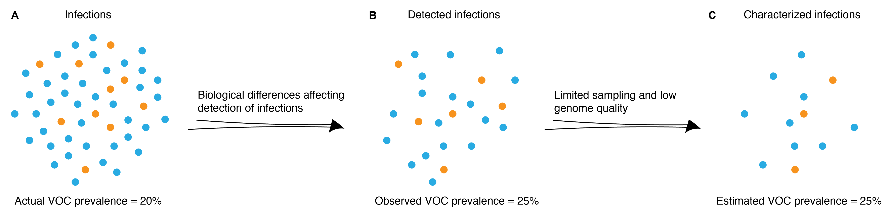

```{r setup, include=FALSE}
knitr::opts_knit$set(root.dir="../")
knitr::opts_chunk$set(fig.width=7.5, fig.height=6, fig.path='../figures/raw/', warning=FALSE, message=FALSE,cache=FALSE,dev=c('png','pdf'))
```

```{r packages, echo=FALSE}

# packages needed for analytical plots
library(ggplot2)
library(dplyr)
library(extraDistr)
library(grid)
library(gridExtra)
library(RColorBrewer)
library(metR)

library(phylosamp)
source("source/sim_funcs.R")
source("source/plot_funcs.R")

```

<br>
<br>

##### Figure S1. Factors resulting in enrichment of observed variant prevalence. 

<br>
<br>


##### Figure S2. Validation of binomial sampling approximation.

```{r sim_params, echo=FALSE}

# ------------ parameter inputs ------------ #

alpha <- 0.4 # probability an infection of each variant is asymptomatic
beta_a <- 0.05 # probability of testing asymptomatic infections
beta_s <- 0.3 # probability of testing symptomatic infections
phi <- 0.95 # probability that a tested infection of each variant results in a positive test
gamma <- 0.6 # probability that a detected infection meets a quality threshold
omega <- 0.8 # probability that a sequenced sample produces a high quality genome

# format parameters
params <- setup.params(2,alpha,beta_a,beta_s,phi,gamma,omega)

# ------------ simulation parameters ------------ #

# infected population size
N <- 10000

# variant proportions to test
v1 <- c(0.01,0.1,0.25,0.5)

# sample proportions (proportion of H) to explore
rhos <- c(0.05,0.3,0.6,0.95)

# number of simulations per variant and sample size
nsim <- 1000


```

```{r sim_sampling, echo=FALSE}

# simulate infection detection and sampling process
sim <- simulate.model.singlevar(nsim=nsim,params=params,N=N,v1=v1,rhos=rhos)

# add binomial distribution values
sim$G.binom <- as.list(as.data.frame(
  round(apply(sim,1,function(x)(rmultinom(1,x$samplesize,x$P.in)))*params["omega",])))
sim$P.out.binom <- as.list(as.data.frame(
  apply(sim,1,function(x) x$G.binom/sum(x$G.binom))))
sim$v1.out.binom <- sapply(1:nrow(sim),function(x) sim[x,"P.out.binom"][[1]][1])
sim$v1.G.binom <- sapply(1:nrow(sim),function(x) sim[x,"G.binom"][[1]][1])

# add hypergeometric distribution values
sim$G.hyper <- as.list(as.data.frame(
  round(apply(sim,1,function(x)(rmvhyper(nn=1,k=x$samplesize,n=x$H)))*params["omega",])))
sim$P.out.hyper <- as.list(as.data.frame(
  apply(sim,1,function(x) x$G.hyper/sum(x$G.hyper))))
sim$v1.out.hyper <- sapply(1:nrow(sim),function(x) sim[x,"P.out.hyper"][[1]][1])
sim$v1.G.hyper <- sapply(1:nrow(sim),function(x) sim[x,"G.hyper"][[1]][1])

```

```{r FigS2, echo=FALSE, fig.width=7.5, fig.height=7}

# plot simulation with distributions on top
# make plots for all sample sizes

rows <- vector(mode = "list", length = length(v1))
plots <- vector(mode = "list", length = length(rhos))
sizes <- rhos*sum(sim[1,]$H[[1]])
  
for(v in 1:length(v1)) {

  for(i in 1:length(rhos)) { plots[[i]] <- plot.dist.validation.var(sim,sizes[i],v1[v]) }
  
  if (v==1) {
    rows[[v]] <- arrangeGrob(textGrob("",gp = gpar(fontsize=9)),
                 textGrob(paste("Sampling fraction: ",rhos[1]*100,"%",sep=""),gp = gpar(fontsize=9)),
                 textGrob(paste("Sampling fraction: ",rhos[2]*100,"%",sep=""),gp = gpar(fontsize=9)),
                 textGrob(paste("Sampling fraction: ",rhos[3]*100,"%",sep=""),gp = gpar(fontsize=9)),
                 textGrob(paste("Sampling fraction: ",rhos[4]*100,"%",sep=""),gp = gpar(fontsize=9)),
                 textGrob(paste("P_v1 = ",v1[v],sep=""),gp = gpar(fontsize=9)),
                 plots[[1]],plots[[2]],plots[[3]],plots[[4]],nrow=2,
                 widths=c(0.8,2,2,2,2), heights=c(1,4))
  } else {
    rows[[v]] <- arrangeGrob(textGrob(paste("P_v1 = ",v1[v],sep=""),gp = gpar(fontsize=9)),
                              plots[[1]],plots[[2]],plots[[3]],plots[[4]],nrow=1,widths=c(0.8,2,2,2,2))
  }
  
}
  
grid.arrange(rows[[1]],rows[[2]],rows[[3]],rows[[4]],nrow=4,heights=c(1.25,1,1,1))

```

<br>
<br>

##### Figure S3. Sample size needed for variant detection and prevalence estimation with 50% confidence.

```{r ss_params, echo=FALSE}

# set up multiple values of coefficient ratios to plot
# desired range: c_ratio from approx 1-3
c1 <- seq(1,3,0.01)
c2 <- rep(1,length(c1))
c_ratio <- c1/c2

# desired probability of detection
prob_detect <- 0.5

# desired confidence in measurement
conf_measure <- 0.5
precision <- 0.25

```

```{r ss_detect_50, echo=FALSE}

## make plot showing how sample size for detection changes with the coefficient of detection

# calculate bias based on desired coefficient ratios
# for a small number of input variant proportions
p <- seq(0.02,0.1,0.02)
b <- expand.grid(p,c_ratio)
colnames(b) <- c("p_v1","c_ratio")
n <- apply(b,1,function(x) phylosamp::calc_samplesize_detect(x["p_v1"][[1]],prob_detect,x["c_ratio"][[1]]))

# create data frame needed for plotting
df <- data.frame(b,n)

# set up colors for plotting
red = brewer.pal(n = 9, "Reds")[4:9]

ss_detect <- ggplot(data = df, aes(x=c_ratio, y=n)) +
  geom_line(aes(color=factor(p_v1)),linewidth=1) +
  scale_colour_manual(values=red,name=expression(P[V[1]])) +
  scale_y_continuous(expand = c(0.02,0), limits = c(0,35), breaks = c(0,10,20,30)) +
  scale_x_continuous(expand = c(0.02,0)) +
  labs(y="Sequences required", x=expression(C[V[1]]/C[V[2]])) +
  theme_bw() +
  theme(axis.line = element_line(colour = "black"),
    panel.border = element_blank(),
    panel.background = element_blank(),
    #legend.position = "bottom",
    legend.title=element_text(size=10))

```

```{r ss_prev_50, echo=FALSE}

## make plot showing how sample size for measuring prevalence changes with the coefficient of detection

# set up colors for plotting
blue = brewer.pal(n = 9, "Blues")[4:9]

# calculate sample size based on these coefficient ratios
# for a small number of input variant proportions
p <- c(0.1,seq(0.2,0.99,0.2))
b <- expand.grid(p,c_ratio)
colnames(b) <- c("p_v1","c_ratio")
n <- apply(b,1,function(x) phylosamp::calc_samplesize_prev(x["p_v1"][[1]],conf_measure,precision,x["c_ratio"][[1]]))

# create data frame needed for plotting
df <- data.frame(b,n)

ss_prev <- ggplot(data = df, aes(x=c_ratio, y=n)) +
  geom_line(aes(color=factor(p_v1)),linewidth=1) +
  scale_colour_manual(values=blue,name=expression(P[V[1]])) +
  scale_y_continuous(expand = c(0.02,0), limits = c(0,75), breaks = seq(0,75,25)) +
  scale_x_continuous(expand = c(0.02,0)) +
  labs(y="Sequences required", x=expression(C[V[1]]/C[V[2]])) +
  theme_bw() +
  theme(axis.line = element_line(colour = "black"),
    panel.border = element_blank(),
    panel.background = element_blank(),
    #legend.position = "bottom",
    legend.title=element_text(size=10))

# make additional plot with precision of 10%
p <- c(0.1,seq(0.2,0.99,0.2))
b <- expand.grid(p,c_ratio)
colnames(b) <- c("p_v1","c_ratio")
n <- apply(b,1,function(x) 
  phylosamp::calc_samplesize_prev(x["p_v1"][[1]],conf_measure,precision=0.1,x["c_ratio"][[1]]))

# create data frame needed for plotting
df <- data.frame(b,n)

ss_prev_10 <- ggplot(data = df, aes(x=c_ratio, y=n)) +
  geom_line(aes(color=factor(p_v1)),linewidth=1) +
  scale_colour_manual(values=blue,name=expression(P[V[1]])) +
  scale_y_continuous(expand = c(0.02,0), limits = c(0,450), breaks = seq(0,400,100)) +
  scale_x_continuous(expand = c(0.02,0)) +
  labs(y="Sequences required", x=expression(C[V[1]]/C[V[2]])) +
  theme_bw() +
  theme(axis.line = element_line(colour = "black"),
    panel.border = element_blank(),
    panel.background = element_blank(),
    #legend.position = "bottom",
    legend.title=element_text(size=10))

```

```{r FigS3, echo=FALSE, fig.height=3, fig.width=10}

grid.arrange(ss_detect, ss_prev, ss_prev_10, nrow = 1)

```

<br>
<br>

##### Figure S4. Sample size needed for detection of a variant growing in prevalence.

```{r params_periodic, echo=FALSE}

# time period to explore
t <- seq(0,40,1)

# growth rates
r <- c(0.1,0.1,0.1,0.1)

# prevalences at time zero (time of introduction)
t0 <- c(1/10000,1/10000,5/10000,5/10000)

# daily sample sizes to explore
n <- seq(1,500,10)

# c ratios to explore
c_ratios <- c(1,3,1,3)
c_labels <- c("c=1,r=0.05,t0=1","c=3,r=0.05,t0=1","c=1,r=0.1,t0=5","c=3,r=0.1,t0=5")

```

```{r heatmaps, echo=FALSE}

# set up data frame for plotting
b <- expand.grid(t,n)
colnames(b) <- c("t","n")
df <- data.frame(b)

for (i in 1:length(c_ratios)){
  prob <- apply(b,1,function(x) phylosamp::calc_prob_detect_cont(x["n"][[1]],x["t"][[1]],t0[i],r[i],c_ratios[i]))
  df <- data.frame(df,prob)
}

colnames(df) <- c("t","n",c_labels)

plots <- lapply(1:length(c_ratios), function(x) plot.ss.logistic(df,c_ratios[x],c_labels[x],t0[x],r[x]))

```

```{r FigS4, echo=FALSE, fig.height=6.5, fig.width=7}

grid.arrange(plots[[1]], plots[[2]], plots[[3]], plots[[4]], nrow=2)

```